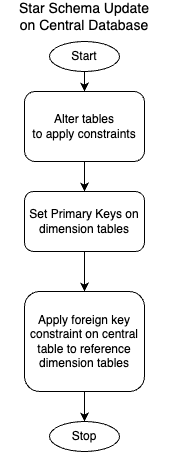
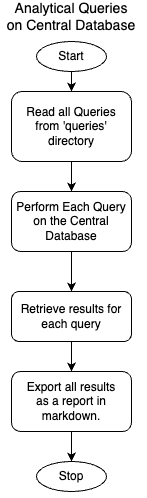

# Multinational Retail Data Centralisation

## Business Objective:
Retail sales data for the company is spread across variety of data sources. The goal of this work is to consolidate, make it easily accessible, and being able to perform analytics. 
This will help the business to make informed policy decisions, understand strengths and weaknesses, and stay competitive.

## Summary
First, a data extraction pipeline retrieves retail data from hybrid sources including structured, unstructured and blob formats. Each source belongs to a specific category such as payment cards data or date and time of each transaction. The data may contain empty or invalid values in one or many fields. Therefore, a domain specific cleaning step is performed. Data entries are removed when most important fields contain erroneous values such as when card number does not conform to standard. When few of non-essential fields have incorrect values they are set to a not-applicable or not-a-number type values which will not affect the analysis results.

In the second stage, this clean data is loaded into the central database tables. The database schema follows star pattern where each topical table has a primary key column which links to the central table via a foreign key relationship. Every column has designated constraint which maintains the consistency.

Finally, analytical queries are created to generate business insights based on the requirements of the sales team.

## High-Level Design
Following schematic shows an overview of data sources going through a processing pipeline which generates corresponding tables in the central database.

## Detailed Design
### Extraction, Cleaning and Consolidation

| Data Category      | Source                | Table in Central DB |
|--------------------|-----------------------|---------------------|
| Users/Customers    | AWS RDS PostgreSQL    | `dim_users`         |
| Payments Cards     | PDF in S3 bucket      | `dim_card_details`  |
| Retail Stores      | REST API Endpoint     | `dim_stores_data`   |
| Products Catalogue | CSV file in S3 bucket | `dim_products`      |
| Orders Details     | AWS RDS PostgreSQL    | `orders_table`      |
| Sales Transactions | JSON resource URI     | `dim_date_times`    |

#### Users Data Cleaning
1. Remove duplicate rows
1. Convert date of birth to date/time format and set to NaN when fails.
1. Convert joining date to date/time format and set to NaN when fails.
1. When date of birth is recent than current time, set to NaN.
1. When joining date is recent than current time, set to NaN.
1. Validate email address with a regex and set blank when fails.
1. Validate phone number with a regex and set blank when fails.

#### Payment Cards Data Cleaning
1. Remove rows with null values.
1. Clean card numbers by removing non-digit characters.
1. Validate card numbers using regex and set NaN when fails.
1. Validate expiry date using regex and set NaN when fails.
1. Validate payment date using regex and set NaN when fails.

#### Retail Stores Data Cleaning
1. Invalid staff numbers set to 0.
2. Invalid addresses with length shorter than 3, rows removed.
3. Validate latitude with regex and set to NaN when fails.
3. Validate longitude with regex and set to NaN when fails.
4. Set locality to 'N/A' where empty or null.
5. Remove rows where store code is invalid.
1. Convert opening date to date/time format and set to NaN when fails.
2. Set store type to blank when empty or invalid.
3. Remove rows where country code is invalid.
4. Set continent to empty where empty or null.

#### Product Details Data Cleaning
1. Remove rows where product name is null or empty.
2. Remove rows where product price does not match the regex or null or, empty.
1. Remove rows where product weight is null or empty.
1. Convert product all unit weights to kilograms for simplicity.
   1. Find multi-pack type products such as '8 x 200g', convert them to single bulk weight.
   2. Convert ml to kg.
   3. Convert oz to kg.
   4. Convert grams to kg.
   5. Since all are in kg now, remove the unit postfix.
#### Orders Data Cleaning
1. Remove specified columns: '1', 'first_name', 'last_name'
#### Sales Transaction Data Cleaning
1. Remove rows with invalid months, valid [1-12].
1. Remove rows with invalid year, valid 4 digit.
1. Remove rows with invalid day, valid [1-31].
1. Remove rows with invalid timestamps.
1. Remove rows with invalid date UUID format.

### Data Processing Workflow
Following figure shows step-by-step flow of data and operations in the data processing pipeline.

### Database Star Schema Implementation
Following figure shows steps to implement the star schema with `orders_data` table as the central table around other dimension tables from section above [Data Tables](#extraction-cleaning-and-consolidation)

An entiry relationship diagram (ERD) of the schema is shown below:

### Analytics Queries
- All the queries according to the specifications are store in a sub-directory `/queries` at the root of the source. 
- These queries are prefixed with requirement as `T#_{keywords_with_underscore}.sql`. For example 7th requirements is in query file `T7_headcount_country.sql`
- All queries are run in sequence using `analytics.py` script.
- It exports the outcome of all queries as a report in a Markdown format.

Following figure shows an overview of the steps performing analytics.

## Installation Instructions

## Usage Instructions

## Lessons Learnt