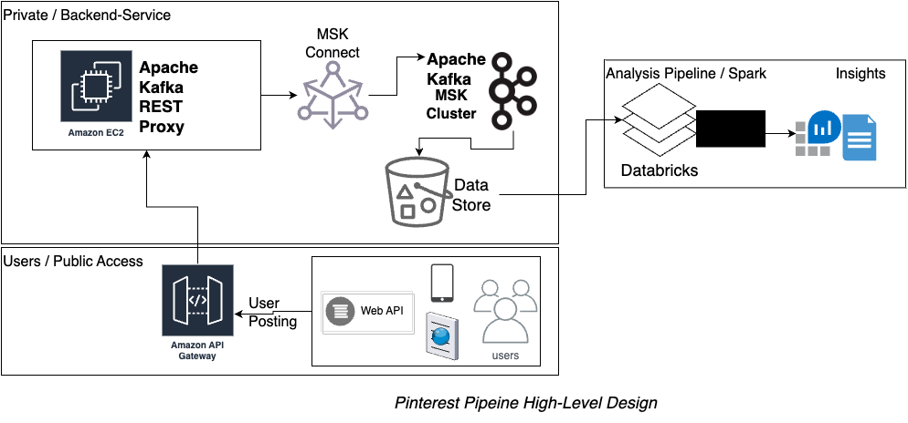

# Pinterest Data Pipeline
Pinterest performsn daily experiments on historical and daily acquired data to create more value for the customers. Goal of this project is to replicate the workflow using AWS Cloud infrastrcture.

Following figure shows a high-level overview of the pipeline:




## Emulating User Posts

`user_posting_emulation.py` script connects to a RDS database containing data resembling Pinterest API with a POST request. 

| Table Name | Columns |
|------------|---------|
| `pinterest_data` | `['index', 'unique_id', 'title', 'description', 'poster_name', 'follower_count', 'tag_list', 'is_image_or_video', 'image_src', 'downloaded', 'save_location', 'category']` |
| `geolocation_data` | `['ind', 'timestamp', 'latitude', 'longitude', 'country']`|
| `user_data` | `['ind', 'first_name', 'last_name', 'age', 'date_joined']`|


## Configuration
### SSH Login to EC2 Instance
1. Save identity file `*.pem` locally using secret for SSH connection in Parameter Store in AWS Account.
2. Using public IP, `ec2-user` and identity file above connect via SSH with 
   `ssh -i <identity file> ec2-user@<EC2 instance public IP>`

### Kafka EC2 Instance
1. Login to EC2 Shell via SSH
2. Install Java 11
3. Install and Configure Kafka 2.8.1
   1. Download from Kafka and extract archive.
   2. Download and add IAM MSK authentication package to `CLASSPATH`
4. Configure EC2 Client Authentication for MSK
   1. Add EC2 Access Role ARN to trust relationship in IAM Roles as a principal.
   2. Update `client.properties` in EC2 Kafka instance configuring bootstrap server.

### Connect Kafka to MSK Cluster
1. Copy Kafka connector to your users S3 bucket under `kafka-connect-s3`.
2. Create custom plugin using MSK Connect console with name `<userID>-plugin`.
3. Create MSK Connector with name `<userID>-connector` using following configuration:
   ```
   connector.class=io.confluent.connect.s3.S3SinkConnector
   s3.region=us-east-1
   flush.size=1
   schema.compatibility=NONE
   tasks.max=3
   topics.regex=<YOUR_UUID>.*
   format.class=io.confluent.connect.s3.format.json.JsonFormat
   partitioner.class=io.confluent.connect.storage.partitioner.DefaultPartitioner
   value.converter.schemas.enable=false
   value.converter=org.apache.kafka.connect.json.JsonConverter
   storage.class=io.confluent.connect.s3.storage.S3Storage
   key.converter=org.apache.kafka.connect.storage.StringConverter
   s3.bucket.name=<BUCKET_NAME>
   ```

### Kafka REST Proxy Integration for API
1. Create AWS API with `{proxy+}` endpoint and HTTP Proxy `ANY` method.
2. Deploy the API using AWS Old Console Interface and note down public invoke URL.
3. On EC2 Kafka instance, setup Confluent Kafka-Rest Proxy Client
   1. Download and extarct Confluent
   2. Donwnload `aws-msk-iam-auth` Java class libray and place it inside Kafka `libs`
   3. Add the library to Java `$CLASSPATH` environment variable.\
      IMPORTANT: **Make sure to set `CLASSPATH` and run `kafka-rest` with same user either `root` or `ec2-user`.**
   4. Run Kafka rest server and send JSON data via POST request using following:
      `./kafka-rest-start /home/ec2-user/confluent-7.2.0/etc/kafka-rest/kafka-rest.properties`
      Run this with sudo if `CLASSPATH` is set as `root`.

When user sends the request via public API gateway, the API then calls the backend service running on our EC2 instance. This results connection to MSK Cluster and data is stored to the designated S3 bucket.

### Databricks Setup with S3
We use datalakes in Databricks for processing the pinterests posts data.

1. Connect S3 bucket to Databricks using credentials CSV file. 
   - *Note: For this project creation of credentials and uploading to databricks is already done.*
2. Mount S3 bucket in databricks using notebook and credentials CSV file.
3. Prepare paths for each of the `pin`, `geo`, and `user` JSON data files.
4. Load these datasets into dataframes `df_pin`, `df_geo` and `df_user`.
   - Notebook for the process is `PinterestPipeline/0a1d8948160f_PinterestDataPipeline.ipynb`

## Databricks Apache Spark Reporting Pipeline
Databricks provides a pre-configured Apache Spark environment in Notebook format.
It supports automatic state persistence which can always resume where you left off.
This avoids rerunning any previous ETL/ELT steps.

For this data pipeline, we first clean the three datasets loaded in `df_pin`, `df_geo` and `df_user`.

### Cleaning `df_pin`
1. Filter `unique_id` column which contain uuid lenght 36.
2. Clean and transform `follower_count`:
   1. First, we filter the rows which match the valid follower count regex `r'[0-9]{1,}[kM]?'`.
   2. Then we transform the follower count in `k` to thousands and `M` to millions, making all values integer format.
3. Rename `index` column to `ind`.
4. Reorder the columns in the dataframe as: `'ind', 'unique_id', 'title', 'description', 'follower_count', 'poster_name',
                   'tag_list', 'is_image_or_video', 'image_src', 'save_location', 'category'`
5. Finally, we replace empty and not-applicable cells with None followed by dropping duplicate rows.

### Cleaning `df_geo`
1. Create a new column `coordinates` as an array of `longitude` and `latitude` followed by dropping the contituent columns.
2. Convert `timestamp` in string to timestamp format.
3. Reorder the columns of the dataframe in the following order: `'ind', 'country', 'coordinates', 'timestamp'`

### Cleaning `df_user`

1. Create a new column `user_name` by concatenating `first_name` and `last_name` followed by dropping the contituent columns.
2. Convert `date_joined` in string to timestamp format.
3. Reorder the columns of the dataframe in the following order: `'ind', 'user_name', 'age', 'date_joined'`.

