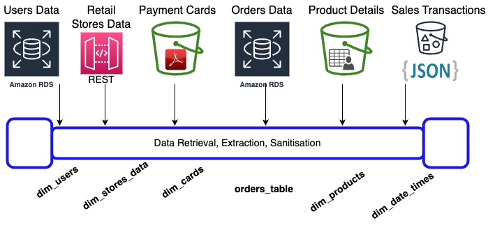

# Data Engineering Immersive Program at AiCore
Projects and coding completed for Data Engineering program at AiCore.

1. [Hangman Game Project](./HangmanProject/)
Python based program to play classic wordgame Hangman via a Terminal interface.

2. [Retail Data Centralisation Project](./DataCentralisationProject/)
Sales data spread across several sources makes it difficult to analyse and make sense of.
Goal of this work is to consolidate data to a centralised location preparing a single source of truth
for business insights, experiments and formulating evidence based strategy.

### Practicals
1. [Advanced SQL](./AdvancedSQL/)
Complex queries to examine cross-relations, analysing data and performing calculations.
2. [Amazon Web Services AWS](./Aws/)
Creating and managing AWS EC2 instances, S3 Bucket and RDS database for applications.

